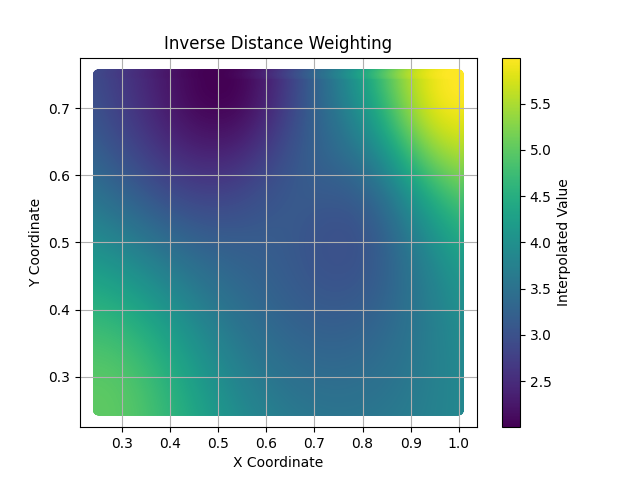
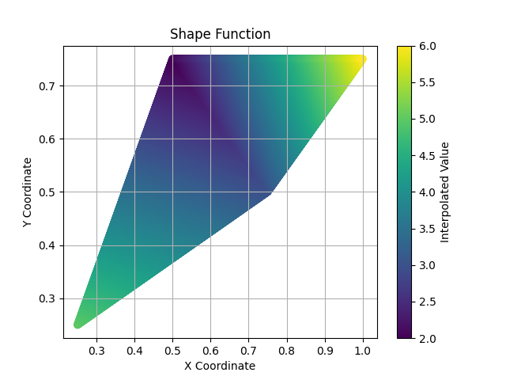

# Geospatial Interpolation

## Overview

A Python-based interpolation CLI that utilizes real-world point-cloud data and spatial interpolation techniques to create a smooth heightmap of a given area.

$$
\begin{align*}
    p_{1} &= (0.25, 0.25, 5.00) & p_{2} &= (0.50, 0.75, 2.00) \\
    p_{3} &= (0.75, 0.50, 3.00) & p_{4} &= (1.00, 0.75, 6.00)
\end{align*}
$$

Inverse Distance Weighting | Shape Function
:-------------------------:|:-------------:
 | 

<!--   -->

## Features

- **Command-Line Interface:** Easily interpolate and save data directly from the command line.
- **Multiple Interpolation Methods:** Choose from two different methods of interpolation to suit your needs.
- **Python Virtual Environment:** Utilizes a Python virtual environment to manage dependencies and ensure a consistent runtime environment.

## Notes

The application currently only supports the Inverse Distance Weighting and Shape Function methods of interpolation.

## Prerequisites

Before using this application, ensure you have Python installed on your machine. You will also need to set up a [virtual environment](https://docs.python.org/3/library/venv.html). After setting up your virtual environment, run

```bash
python -m pip install -r requirements.txt
```

to install all necessary dependencies.

## Usage

```bash
python main.py [-h] [-p POWER] [-r RESOLUTION] [-s] {inverse_distance_weighting,shape_function} points
```

positional arguments:

- `{inverse_distance_weighting,shape_function}`: The interpolation method used.
- `points`: The relative path to the CSV file containing the 3-dimensional point data.

options:

- `-h`, `--help`: Show the help message and exit
- `-p POWER`, `--power POWER`: The power parameter, $p$, used in the Inverse Distance Weighting equation **(default: 2)**.

$$
\displaystyle z_{p} = \frac{\sum_{i=1}^{n}{\frac{z_{i}}{d_{i}^{p}}}}{\sum_{i=1}^{n}{\frac{1}{d_{i}^{p}}}}
$$

- `-r RESOLUTION`, `--resolution RESOLUTION`: The number of subdivisions along each axis **(default: 50)**.
- `-s,` `--save`: Save the data as a CSV file to the same directory where the 3-dimensional point data is stored.
